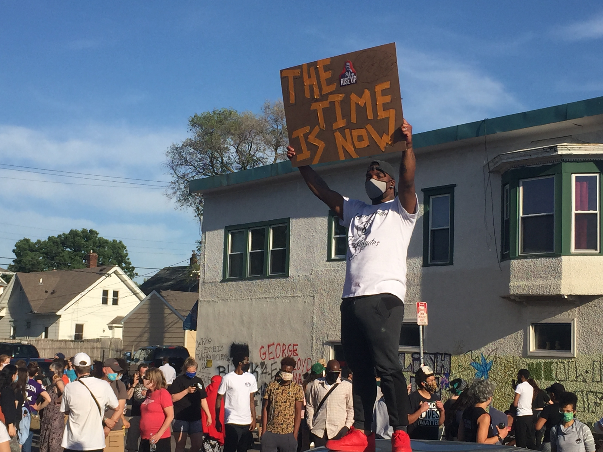

<!-- TODO: move image to Frontmatter to be used as preview on home page -->

How will history remember these times?
How will society envision itself when a sense of normalcy reemerges?
What meaning will we create from these crises of health unfolding?

I hope there is movement — movements.
I hope it is momentous:
not merely a comforting realignment within the narrow bounds of failed promises,
but a nudge, which historians will describe as being so expertly applied
it propelled us into a brand new state of being.

Because, “Of course!” we will say,
with the confidence of those so fortunate
to exist within the context on the other side of tragedy,
“We had been blind all along. _They_ had been blind; woefully ignorant.”

“How?” we will ask, “could those who lived before society was made anew
not have realized the travesties already all around them,
on display if only they had looked,
calling out if only they had cared enough to listen?”

I hope we finally lift up the vulnerable.
They have been waiting for far too long.
